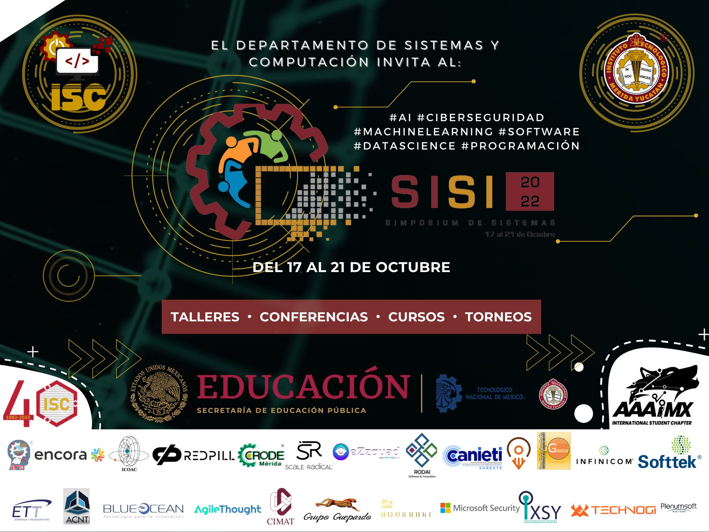

# Taller de desarrollo de plataformas web con Vue.JS y Django.
## Repositorio creado durante el SISI 2022.

SISI: Simposium de Sistemas Computacionales del instituto Tecnológico de Mérida.

----------------------------------

----------------------------------

1. Crear repositorio en GitHub.
2. Clonar repositorio.
3. Crear entorno virtual.
    - `$  python3 -m venv venv`
4. Activar entorno virtual.
    - `$ source venv/bin/activate`
5. Instalar django
    - `$ pip install django`
6. Crear proyecto (dentro del entorno virtual).
    - `$ django-admin startproject 'nombre proyecto'`
7. Sacar el manage.py a la carpeta raíz sacar archivos de carpeta extra que se crea al dar startproject (mas fácil en explorador).

8. init.py con este archivo el sistema entiende que dentro de esas carpetas hay código que ejecutar.
9. asgi puente para ejecución que ejecuta y levanta el servidor.
10. settings.py configuración del proyecto, rutas de base de datos, idioma, dirección de imagenes etc.
11. urls.py para ejecutar codigo web todoo lo haces atraves de urls aqui se estructura como se va a ver.
12. wsgi.py funcionalidad de ejecución.
13. Crear funcion de python en urls para dar ejemplo de como se ejecuta en terminal, en django si se debe pasar parametro forzoso. 
    `def saludo(self):`  
    `print('Hola mundo')`  
    `return True`
------------------------------------------

## JUEVES

### APLICACIONES

1. Crear carpeta applications a la altura del manage.py
poner archivo __init_.py dentro de la carpeta aplications
entrar a la carpeta y crear apps.  
`$ django-admin startapp 'nombre app'`
2. Ir al settings base.py y dar de alta las aplicaciones, modificar dentro del archivo apps.py de la aplicación el name apuntando a la carpeta.
-------------------------------------------
### VARIABLES DE ENTORNO
    $ pip freeze > requirements.txt
1. Crear carpeta settings a la altura de inventarios.
2. Colocar archivo __init__.py dentro dse la carpeta.
3. Agregar 3 archivos que seran nuestros entornos: local.py, base.py, prod.py
4. Poner en el archivo base.py todos los componentes de settings que usamos en local y prod
5. Importar dentro de local el archivo base.py $$ from .base import *
6. Cambiar nombre a settings.py original.
7. Ejecutar variable de entorno local.py.  
    $ python manage.py runserver --settings=inventarios.settings.local
8. En manage.py dice que entorno va a utilizar.

------------------------------------------
## SERIALIZERS APIS
Instalar django rest framework, seguir documentación
1. crear archivo serializers.py
2. Se crea serializer, view, url
-----------------------------------------
## Features

- Django 3.0+
- [Django REST Framework](https://www.django-rest-framework.org/) - Powerful and flexible toolkit for building Web APIs.
- [Django Cors Headers](https://pypi.org/project/django-cors-headers/) - A Django application for handling the server headers required for Cross-Origin Resource Sharing (CORS).
- [Django Filter](https://django-filter.readthedocs.io/en/stable/) - Simple way to filter down a queryset based on parameters a user provides.
- [Simple JWT](https://django-rest-framework-simplejwt.readthedocs.io/en/latest/) - A JSON Web Token authentication plugin for the Django REST Framework.
- [Whitenoise](http://whitenoise.evans.io/en/stable/) - Radically simplified static file serving for Python web apps
- Procfile for running gunicorn with New Relic's Python agent.
- Support for automatic generation of [OpenAPI](https://www.openapis.org/) schemas.
- Automated generation of real Swagger/OpenAPI 2.0 schemas from Django REST Framework code with [drf-yasg](https://drf-yasg.readthedocs.io/en/stable/).

## Prerequisites

- Python 3.7>
- Virtualenv
## Instalation

    $ python3 -m venv venv
    $ source venv/bin/activate
    $ pip install -r requirements.txt

## Environment

Application running in multiple environments like DEV and PROD. All env variables used in this application are available in `.env.example`, feel free to setup your own environment configuration.

### DEV

Just make a copy from `.env.local.example` and/or rename to `.env.local` and setup your variables. Then run in terminal:

    $ source .env.local

The first time you run the application, make sure to apply the database migrations and create a super user account:

    $ python manage.py migrate
    $ python manage.py createsuperuser

Finally start development server:

    $ python manage.py runserver

### PROD

Just make a copy from `.env.production.example` and/or rename to `.env.production` and setup your variables. Then run in terminal:

    $ source .env.production

The first time you run the application, make sure to apply the database migrations, create a super user account and generate static files:

    $ python manage.py migrate
    $ python manage.py createsuperuser
    $ python manage.py collectstatic --no-input

Finally start production server:

    $ gunicorn project.wsgi --log-level=INFO

## Run tests

    $ python manage.py test